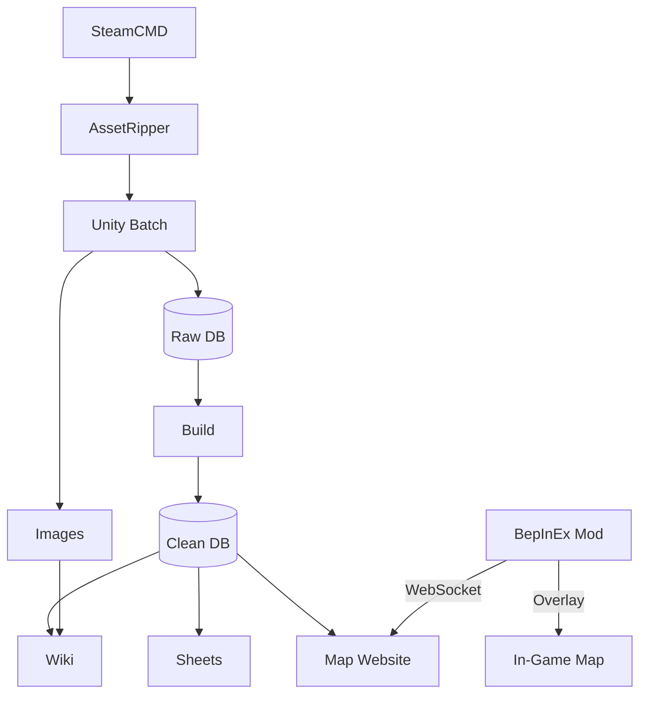

# CLAUDE.md

Guidance for Claude Code when working with this repository.

## Project Overview

Data mining project for Erenshor, a single-player simulated MMORPG. Extracts
game data via AssetRipper, exports to SQLite via Unity Editor scripts, deploys
to MediaWiki, Google Sheets, and an interactive map website. Includes companion
mods for real-time game integration.

**CRITICAL**: Only modify code in `src/Assets/Editor/`, `src/erenshor/`,
`src/mods/`, and `src/maps/`. All other files are from the original game and
MUST NOT be changed.

**GitHub Project**: [Erenshor Data Mining](https://github.com/users/glockyco/projects/3/)
tracks all development work including data mining, wiki, maps, and mods.

## Project Context

- **Solo Developer**: Hobby project, single maintainer
- **Zero Cost**: Free tools only (SteamCMD, AssetRipper, Unity Personal)
- **Multi-Variant**: Handles main, playtest, and demo game versions
- **Unity Constraints**: Non-Editor code belongs to game developer

## Architecture



**Entry point**: `uv run erenshor`

Components:
- **src/erenshor/**: Python CLI for data extraction and deployment
- **src/Assets/Editor/**: Unity Editor scripts for SQLite export
- **src/maps/**: SvelteKit interactive map website (Cloudflare Workers)
- **src/mods/**: BepInEx companion mods for real-time features

Three game variants with separate pipelines:
- **main** (App ID 2382520): Production release
- **playtest** (App ID 3090030): Beta testing
- **demo** (App ID 2522260): Free demo

**Variant directories** (`variants/{variant}/`) are .gitignored but essential
for data mining work:
- `variants/{variant}/game/` — downloaded game installation
- `variants/{variant}/unity/ExportedProject/Assets/Scripts/` — decompiled
  C# game scripts (critical for understanding game mechanics, writing
  export scripts, and verifying data mining correctness)
- `variants/{variant}/unity/ExportedProject/Assets/` — all AssetRipper
  exported game assets (prefabs, scenes, scriptable objects, etc.)

These directories must be read frequently even though they are not tracked
in git. Run `extract download` and `extract rip` to populate them.

## Essential Commands

```bash
uv run erenshor --help              # All command groups
uv run erenshor <group> --help      # Subcommands for any group
uv run erenshor --variant playtest <command>  # Use different variant
uv run pytest                       # Run tests
uv run pre-commit run --all-files   # Run linters
```

### Common Workflows

**New game version** (full pipeline):
`extract download` → `extract rip` → `extract export` → `extract build`
→ `wiki fetch` → `wiki generate` → `golden capture` → review diffs →
`sheets deploy --all-sheets` → `maps build --force` → `maps deploy` → `wiki deploy`

**Rebuild after changing build logic** (fast, no re-export needed):
`extract build` re-reads the raw DB without re-exporting, then follow
the deploy steps above from `wiki generate` onwards.

**Wiki update**:
`wiki fetch` → `wiki generate` → `golden capture` → review diffs →
`wiki deploy`

Always run `golden capture` before deploying and review every diff.
Golden files in `tests/golden/` are the source of truth for detecting
unintended data changes. Commit the updated goldens after review.

**Image update**:
`images process` → `images compare` → `images report` → `images upload`

**Maps deployment**:
`maps build --force` → `maps deploy`

**Mod development**:
`mod setup` (copy game DLLs, needed once after download) → `mod build`
→ `mod deploy` (local testing) or `mod publish` (stage for website) or
`mod thunderstore` (publish to Thunderstore)

## Development Guidelines

1. Only modify `src/Assets/Editor/`, `src/erenshor/`, `src/mods/`, and `src/maps/`
2. Use `uv` for Python dependencies
3. Maintain Unity 2021.3.45f2 compatibility
4. Test changes across all variants
5. Type hints required for Python code
6. Run pre-commit hooks before committing

## Collaboration Expectations

Prioritize accuracy over agreement. Avoid sycophantic behavior.

- **Challenge when appropriate**: If a request seems wrong, say so directly.
  Propose alternatives instead of just complying.
- **Flag concerns proactively**: Outdated patterns, inconsistencies, potential
  bugs, architectural issues - raise them without being asked.
- **Verify before stating**: Don't write docs or make claims without checking
  actual code. Grep, read files, confirm.
- **Ask instead of assuming**: When details are unclear, ask. Don't fill gaps
  with guesses that might be wrong.
- **Maintain positions when correct**: If pushback is based on misunderstanding,
  explain clearly rather than immediately yielding.

## Code Quality Principles

1. **Validate Every Claim**: Never make claims without checking actual code.
   Search the codebase, read files, verify implementations.

2. **Fail Fast**: No fallback functionality that hides errors. Fail immediately
   with clear messages.

3. **No Backward Compatibility**: Clean breaks when changing behavior. No
   legacy code paths "just in case".

4. **Keep It Simple**: No extra config options or features. Suggest improvements
   but only implement after discussion.

5. **Clean Cuts Only**: Remove old code entirely when refactoring. Less code
   means less maintenance.

6. **Minimal Comments**: Don't comment obvious code. Comments explain why,
   not what.

7. **Atomic Commits**: One concept per commit. Conventional commits format.
   Prose descriptions, not bullet lists. 80 char line limit.

8. **Fix All Errors**: Don't ignore errors. Fix bugs discovered during testing.

## Important Constraints

1. **Unity Version**: Must use Unity 2021.3.45f2 exactly
2. **Steam Credentials**: Requires valid Steam account with game ownership
3. **Symlinks**: C# files symlinked, DLLs copied (Unity limitation)
4. **Batch Mode**: Unity exports run headless via CLI
5. **Service Account**: Google Sheets requires Editor access

## Testing

```bash
uv run pytest                    # All tests
uv run pytest --cov              # With coverage
uv run pytest -m integration     # Integration tests only
```

CI runs on all pushes: linting (Ruff), type checking (MyPy), secret scanning
(Gitleaks), and full test suite.

## Database Files

Exported SQLite databases are stored per-variant:
- `variants/main/erenshor-main.sqlite` - Production release data
- `variants/playtest/erenshor-playtest.sqlite` - Beta/playtest data
- `variants/demo/erenshor-demo.sqlite` - Demo version data

## Mod Development

The `src/mods/` directory contains BepInEx companion mods:

- **InteractiveMapCompanion**: Real-time entity tracking for the interactive map
- **InteractiveMapsCompanion** (legacy): Broadcasts player position. Must be
  kept working when data structures or DB schema change, but should not receive
  new features. New map features go in InteractiveMapCompanion.
- **JusticeForF7**: Extends F7 screenshot mode to hide world-space UI elements
- **Sprint**: Configurable sprint key with multiplicative speed boost

Map-related mods follow patterns from [erenshor-logs](https://github.com/glockyco/erenshor-logs):
- Dependency injection for composition
- Generic + adapter pattern for testability
- Harmony patches with static property injection
- Fleck for WebSocket server (InteractiveMapCompanion only)

## Companion Mod Pipeline

The mod build pipeline is fully automated: `setup` (copy DLLs) → `build` (compile,
version from git) → `publish` (stage for website) → website build (includes mods).
Version numbers use CalVer format (YYYY.M.D.{decimal_hash}) derived from git commit
date/hash—never manually specified. Metadata is generated to both source and website
locations, kept in sync by construction. Pre-commit hooks validate locally, CI
validates on every push. See `mod-build-pipeline` skill for detailed workflows.
