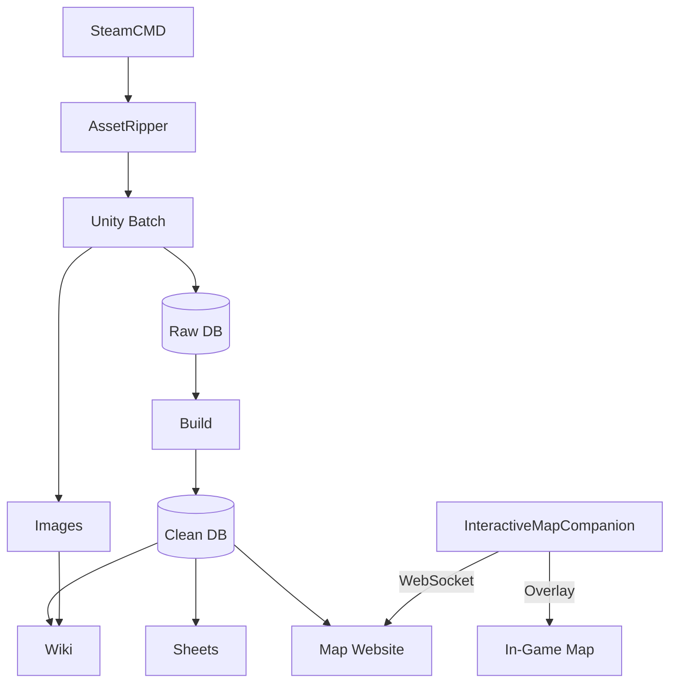

# Erenshor Data Mining & Wiki Publishing Pipeline

Data mining pipeline for [Erenshor](https://store.steampowered.com/app/2382520/Erenshor/), a single-player RPG designed to capture the feel of an MMORPG. Downloads game files from Steam, extracts Unity assets, exports to SQLite, and publishes to MediaWiki and Google Sheets. Includes an interactive map website and BepInEx companion mods for real-time game integration.

---

## Prerequisites

- **Unity 2021.3.45f2** (exact version required)
- **Python 3.13+**
- **SteamCMD**
- **AssetRipper**
- **uv** (Python package manager)
- **Steam account** with Erenshor ownership
- **8 GB+ RAM** and **20 GB+ disk space** per variant

---

## Quick Start

```bash
# Clone and install
git clone https://github.com/glockyco/erenshor-data-mining.git
cd erenshor-data-mining
uv sync --dev

# Configure local settings (tool paths, Steam credentials)
cp config.toml .erenshor/config.local.toml
# Edit .erenshor/config.local.toml — see Configuration below

# Run the extraction pipeline
uv run erenshor extract download   # Download game from Steam
uv run erenshor extract rip        # Extract Unity project via AssetRipper
uv run erenshor extract export     # Export assets to SQLite
uv run erenshor extract build      # Build clean database from raw export
```

Expected output: `variants/main/erenshor-main.sqlite` (~50 MB).

---

## Architecture

### Components

- **Python CLI** (`src/erenshor/`): orchestrates the entire pipeline via `uv run erenshor`
- **Unity export scripts** (`src/Assets/Editor/`): C# scripts that scan game assets and write to SQLite
- **Interactive map** (`src/maps/`): SvelteKit website deployed to Cloudflare Workers; shows live player position and entity locations when the InteractiveMapCompanion mod is installed
- **Companion mods** (`src/mods/`): BepInEx mods that run inside the game
  - *InteractiveMapCompanion*: streams entity positions to the map website via WebSocket
  - *Sprint*: configurable sprint key with speed boost
  - *JusticeForF7*: extends F7 screenshot mode to hide world-space UI
  - *InteractiveMapsCompanion*: legacy position broadcast mod; maintained but no new features

### Pipeline



---

## Variants

Three game variants run through separate pipelines:

| Variant      | App ID  | Description        |
| ------------ | ------- | ------------------ |
| **main**     | 2382520 | Production release |
| **playtest** | 3090030 | Beta testing       |
| **demo**     | 2522260 | Free demo          |

Target a specific variant with `--variant`:

```bash
uv run erenshor --variant playtest extract download
```

---

## Configuration

Two-layer TOML configuration:

1. `config.toml` — project defaults, tracked in git
2. `.erenshor/config.local.toml` — local overrides, **not** tracked

**`config.toml` (project defaults):**

```toml
[global.unity]
path = "/Applications/Unity/Hub/Editor/2021.3.45f2/Unity.app/Contents/MacOS/Unity"
version = "2021.3.45f2"

[global.mediawiki]
api_url = "https://erenshor.wiki.gg/api.php"

[global.google_sheets]
credentials_file = "$HOME/.config/erenshor/google-credentials.json"

[variants.main]
app_id = "2382520"
database = "$REPO_ROOT/variants/main/erenshor-main.sqlite"
```

**`.erenshor/config.local.toml` (your overrides):**

```toml
[global.steam]
username = "your_steam_username"

[global.mediawiki]
bot_username = "YourUsername@BotName"
bot_password = "your_bot_password"

[variants.playtest]
enabled = true
```

### MediaWiki bot credentials

1. Log in to the wiki account
2. Go to `Special:BotPasswords`
3. Create a bot password with the "Edit existing pages" grant
4. Add `bot_username` and `bot_password` to `.erenshor/config.local.toml`

### Google Sheets credentials

1. Go to [Google Cloud Console](https://console.cloud.google.com)
2. Create a project and enable the Google Sheets API
3. Create a service account with "Editor" role
4. Download the JSON key file to `~/.config/erenshor/google-credentials.json`
5. Share each spreadsheet with the service account email

---

## CLI Overview

All commands are run via `uv run erenshor <group> <subcommand>`. Use `--help` on any group or subcommand for flags and options.

| Group      | Subcommands                                         | Purpose                              |
| ---------- | --------------------------------------------------- | ------------------------------------ |
| `extract`  | `download`, `rip`, `export`, `build`, `ide-setup`   | Game → Unity → SQLite pipeline       |
| `wiki`     | `fetch`, `generate`, `deploy`                       | MediaWiki three-stage publish        |
| `sheets`   | `list`, `deploy`                                    | Google Sheets publish                |
| `images`   | `process`, `compare`, `report`, `upload`            | Game image processing and upload     |
| `maps`     | `dev`, `preview`, `build`, `deploy`                 | Interactive map website              |
| `mod`      | `setup`, `build`, `deploy`, `publish`, `thunderstore`, `launch` | BepInEx mod pipeline    |
| `golden`   | `capture`                                           | Snapshot expected output for diffing |
| `backup`   | `list`                                              | List database backups                |
| `config`   | `show`                                              | Inspect resolved configuration       |
| `test`     | *(bare)*, `unit`, `integration`                     | Run test suite                       |
| `docs`     | `generate`                                          | Generate documentation               |
| `version`  | —                                                   | Show version                         |
| `status`   | —                                                   | Show tool paths and database state   |

---

## Common Issues

Run `uv run erenshor status` first — it verifies tool paths (Unity, AssetRipper) and database presence in one shot.

**Log locations:**
- Global: `.erenshor/logs/`
- Per-variant: `variants/{variant}/logs/`
- Unity export output: `variants/{variant}/logs/export_*.log`


---

## Development

```bash
# Install dev dependencies
uv sync --dev

# Install pre-commit hooks (run once, and again if .pre-commit-config.yaml changes)
uv run pre-commit install

# Tests
uv run pytest                    # All tests
uv run pytest --cov              # With coverage
uv run pytest -m integration     # Integration tests only

# Code quality
uv run ruff format src/ tests/   # Format
uv run ruff check src/ tests/    # Lint
uv run mypy src/                 # Type check
uv run pre-commit run --all-files  # All hooks
```

CI runs on every push and PR: Ruff, MyPy, Gitleaks secret scanning, and the full pytest suite. View results at [GitHub Actions](https://github.com/glockyco/erenshor-data-mining/actions).

---
