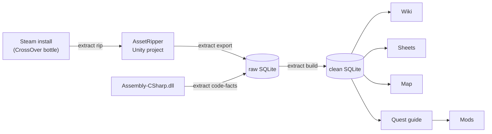

# Erenshor Data Mining

Game data for the single-player MMORPG [Erenshor](https://store.steampowered.com/app/2382520/Erenshor/), extracted from the shipped build and published as a wiki, spreadsheets, an interactive map, and in-game companion mods.

[Wiki](https://erenshor.wiki.gg) · [Interactive map](https://erenshor.compendiums.org)

## What it publishes

- **Wiki** (`erenshor.wiki.gg`). Generated item, character, ability, and stance articles, Lua data modules for links and tooltips, and repository-owned templates. Editors write the prose. The pipeline owns the generated data.
- **Google Sheets.** One tab per query in `src/erenshor/application/sheets/queries/`.
- **Interactive map** (`erenshor.compendiums.org`). A SvelteKit and deck.gl site with every spawn, resource, and location, plus live positions from the companion mod.
- **Companion mods.** AdventureGuide (quest guide and navigation), InteractiveMapCompanion (live map data), Sprint, and JusticeForF7. MapTileCapture is an internal tool. Each mod builds for BepInEx and Lunaris.

Every published fact comes from the clean database of the current shipping build.

## How it works


```mermaid
flowchart LR
  steam["Steam install<br/>(CrossOver bottle)"] -->|extract rip| unity["AssetRipper<br/>Unity project"]
  unity -->|extract export| raw[("raw SQLite")]
  dll["Assembly-CSharp.dll"] -->|extract code-facts| raw
  raw -->|extract build| clean[("clean SQLite")]
  clean --> wiki["Wiki"]
  clean --> sheets["Sheets"]
  clean --> maps["Map"]
  clean --> guide["Quest guide"] --> mods["Mods"]
```

1. **Rip and export.** `extract rip` turns the installed game into a Unity project with AssetRipper. `extract export` runs the editor scripts in `src/Assets/Editor/` in Unity batch mode. They write tables that mirror the Unity assets into `variants/<variant>/erenshor-<variant>-raw.sqlite`, without merging or filtering.
2. **Code facts.** `extract code-facts` reads constants that the game hardcodes (drop chances, level gates, formulas) from the shipped assembly into the raw database. The clean build fails without them.
3. **Clean build.** `extract build` applies `mapping.json` (display names, exclusions, overrides with a reason), deduplicates characters, derives columns, and writes `variants/<variant>/erenshor-<variant>.sqlite`. The schema lives in `src/erenshor/application/processor/writer.py`.
4. **Consumers.** The wiki generators, the sheet queries, the map build, and the quest guide compiler read only the clean database.

### Concepts worth knowing

- **Stable keys.** Every entity has a `stable_key` such as `item:head - 7 - arcanist cap`. Names and pages are not unique and never join data. Characters placed in a scene with a duplicate name get coordinates in their key.
- **Variants.** `main` (Steam app 2382520), `playtest` (3090030), and `demo` (2522260) have separate installs, Unity projects, and databases. Select one with `-V`. The wiki publishes only the current shipping build.
- **Encounter tiers.** Each character is `npc`, `enemy`, `elite`, or `boss`, derived in the clean build from faction, boss XP, and spawn placements. `mapping.json` can override a tier with a reason.
- **Drop sources.** `loot_drops` holds each character's own table, `item_drops` holds items that yield items, and `special_world_drops` holds the rolls that every kill makes at the default loot rate.
- **Spawn coverage.** Some spawns are scripted at run time. The dynamic-spawn catalog in `src/Assets/Editor/ExportSystem/AssetScanner/` classifies every spawning script, and the export fails when a new one is unclassified.
- **Generated and written content.** On the wiki, the bot owns generated templates and data modules. Prose, notes, and strategy belong to editors and survive every refresh.

## Repository layout

| Path | What it holds |
| --- | --- |
| `src/erenshor` | The `erenshor` CLI: extraction, clean build, wiki, sheets, maps, mods, tests. |
| `src/Assets/Editor` | Unity editor scripts for the raw export. |
| `src/tools` | Native analyzers (CodeFacts, ExportSurface) and maintenance scripts. |
| `src/maps` | The interactive map site. |
| `src/mods` | The companion mods and their packaging. |
| `wiki` | Repository-owned wiki pages: Lua modules, templates, gadgets, zone and mechanics pages. |
| `wiki-dev` | A local MediaWiki stack for testing wiki changes. |
| `quest_guides` | Generated and curated quest guide data for AdventureGuide. |
| `tests` | Unit, contract, system, data, and golden baseline tests. |
| `openspec` | Requirements (`specs/`) and the reasoning behind each change (`changes/`). |
| `.agent/skills` | Step-by-step procedures for recurring work. |

`variants/` (game files, Unity projects, databases, generated output) and `.erenshor/` (local configuration and logs) are not tracked.

## Getting started

The Nix flake's dev shell provides Python and uv, the .NET SDKs, Node and pnpm, AssetRipper, and `sqlite3`. With nix-direnv it loads in the working tree. Otherwise run `nix develop`. Every command below assumes the dev shell.

```sh
nix run .#bootstrap                  # locked JavaScript packages and .NET tools
pnpm exec lefthook install --reset-hooks-path
erenshor status                      # tool paths, installs, and database state
```

The shell never compiles a toolchain from source. If entering it starts a compiler, stop it and check `nix build --dry-run 'path:.#devShells.aarch64-darwin.default'`: the plan must not contain `swift`, `dotnet-vmr`, or `dotnet-stage0`.

Three things the shell cannot provide:

- **Unity 2021.3.45f2**, installed through Unity Hub. `extract export` refuses any other version.
- **CrossOver with a Steam bottle** that has each variant installed. The CLI finds an install by its Steam app ID. Set `CROSSOVER_BOTTLE` when there are several bottles.
- **Credentials.** Copy `config.local.toml.example` to `.erenshor/config.local.toml` and fill in the wiki bot and interface logins. The Google service account key path is set there too. The Thunderstore token goes into `.env` (see `.env.example`). `config.toml` holds the tracked defaults, and an unknown key is an error.

## Common work

| Command | What it does |
| --- | --- |
| `erenshor extract packages` | Restores the Unity editor packages, once per checkout. |
| `erenshor extract rip` / `export` / `code-facts` / `build` | Runs the pipeline steps above. |
| `erenshor extract changes` | Compares the clean database with the previous backed-up build. |
| `erenshor golden capture` | Writes snapshots of published output to `tests/golden/`. Review the diff after every data change. |
| `erenshor wiki fetch` / `generate` | Fetches live articles and merges regenerated data into them. |
| `erenshor wiki generate-lua` / `deploy-repo-pages` | Generates the Lua data modules and deploys repository-owned modules and templates with revision guards and rollback data. |
| `erenshor sheets deploy` | Publishes the sheet queries. |
| `erenshor maps dev` / `build` / `preview` / `deploy` | Develops, verifies, and deploys the map. |
| `erenshor mod build` / `deploy` / `thunderstore` | Builds, installs, and packages the mods. `-V` selects the game install, `--loader` the loader. |
| `erenshor guide compile` | Compiles `quest_guides/guide.json` for AdventureGuide. |
| `erenshor eval run '<C#>'` | Evaluates code in the running game through HotRepl. |
| `erenshor capture run` | Captures map tiles through MapTileCapture. |

Run every subsystem through `erenshor`, not through `pnpm`, `wrangler`, or `dotnet` directly. `erenshor <group> --help` lists the options.

### Game updates

A new Steam build runs through backup, rip, export, code facts, and build, then through the checks and deploys of each consumer. The [refreshing-game-data skill](.agent/skills/refreshing-game-data/SKILL.md) gives the order and the gates.

### Rules for changes

- Never edit the decompiled game scripts under `variants/<variant>/unity/ExportedProject/Assets/Scripts/`, other ripped assets, or the installed game.
- Never edit generated output by hand: databases, `quest_guides/guide.json`, map builds, captured tiles, generated wiki pages, or mod metadata. Change the generator and regenerate.
- Golden baselines and deploys to the wiki, the map, or the sheets need the maintainer's approval.
- The live map keeps its legacy contract: `/map` with the `layers` and `sel` parameters on both hosts, WebSocket ports 18584 and 18585, and `/db/erenshor.sqlite`.

### Design principles

Interfaces (wiki, map, mods) put evidence before decoration: show source, identity, state, and failure plainly. Use the host platform's conventions (MediaWiki, the web, the game) instead of a new visual language. Keep safe paths obvious: preview before mutation, fail before destructive actions. Target WCAG 2.2 AA with complete keyboard use.

## Testing

```sh
erenshor test ci                     # what CI runs: static checks, unit, contract, maps, mods
erenshor test unit                   # one leaf
erenshor -V main test release        # adds main data, clean wiki parity, real builds, package checks
```

`uv run pytest` alone is not CI. The maps leaf prerenders the site against the fixture database in `src/maps/tests/fixtures/`, which has a different schema from the real one, so a query that works against the real database can fail in CI. `erenshor test wiki` needs the local MediaWiki stack described in `wiki-dev/README.md`. Each leaf writes a report under `artifacts/test-reports/`.

## Dependencies

| Graph | Versions | Lock |
| --- | --- | --- |
| Nix | `flake.nix` | `flake.lock` |
| Python | `pyproject.toml` | `uv.lock` |
| pnpm | `package.json` files | root `pnpm-lock.yaml` |
| NuGet | `src/Directory.Packages.props` | each project's `packages.lock.json` |
| .NET tools | `.config/dotnet-tools.json` | exact versions |
| GitHub Actions | workflow `uses:` | full commit SHAs |

Renovate updates everything except Nix. The private `glockyco/dependency-automation` workflow updates Nix and the pnpm version in `flake.nix`, and opens a pull request. After a manual change, regenerate the lock (`uv lock`, `pnpm install --lockfile-only`, `dotnet restore --force-evaluate` once per mod loader, or `nix flake update` and `nix run .#sync-pnpm-version`) and run `erenshor test dependency-state`.

## Troubleshooting

- **Setup.** `erenshor status` reports tool paths, installs, and database state. Logs are in `.erenshor/logs/` and `variants/<variant>/logs/`.
- **Git hooks fail with exit 127.** Git clients without a shell call hooks without the dev shell. Hook jobs that need project tools run through `scripts/with-dev-env.sh`.
- **Live map does not connect.** The game must run InteractiveMapCompanion, which serves `ws://localhost:18585`.

## Further reading

- [`openspec/specs`](openspec/specs/) states what the pipeline and its outputs must do. Each change under [`openspec/changes`](openspec/changes/) records why it was made.
- [`.agent/skills`](.agent/skills/) holds the procedures for game updates, exports, code facts, wiki, sheets, map, tile capture, mods, and runtime inspection.
- Commit messages explain why each change exists.

## License

MIT. See [LICENSE](LICENSE).

Erenshor Data Mining is an unofficial fan project and is not affiliated with the developer of Erenshor.
