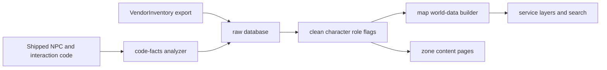

# Map Service Discovery

**Goal:** Make merchants, banks, and auction houses immediately discoverable on
the world map without requiring players to know an NPC's name. Service roles are
first-class map data, search results, markers, filters, and zone-page facilities.

## Problem

The map currently puts every friendly character in one blue NPC layer with the
same person icon and one `NPCs` toggle. A merchant differs only after the player
searches for its name or opens its popup. Banks and auction houses are even less
discoverable because their role is not modeled in the clean database or map
types. Searching `bank`, `auction house`, or `merchant` does not directly return
the relevant facilities.

Item search already resolves items to vendors and should remain the answer to
"where can I buy this item?" This change answers the inverse question: "where is
the nearest service?"

## Authoritative roles

Model three independent service roles on clean characters:

- **Merchant:** existing `characters.is_vendor`, derived from authored
  `VendorInventory` data.
- **Banker:** the four permanent NPCs named by both the game interaction path and
  its `<Banker>` nameplate logic: Prestigio Valusha, Validus Greencent, Comstock
  Retalio, and Wealthen Giallara.
- **Auction broker:** the two permanent NPCs named by both the game interaction
  path and its `<Auction Broker>` nameplate logic: Thella Steepleton and Goldie
  Retalio.

Extract the banker and auction-broker name sets as code facts from the shipped
assembly, then derive `characters.is_banker` and `is_auction_broker` during the
clean build. The analyzer must fail when the interaction and nameplate sets drift
apart. Do not hardcode these names in TypeScript.

`Summoned: Pocket Bank` and `Summoned: Pocket Auctions` are portable player
abilities, not fixed world facilities. Their disabled prefab and scene rows must
not become static service markers. They may receive role metadata for other
consumers, but the map excludes them from facility locations.

A character may hold more than one service role. The schema and UI must use
independent booleans rather than one mutually exclusive enum.

## Map presentation

### Layers and controls

Replace the single NPC control with a **Services & NPCs** group containing
independent URL-persisted toggles:

1. Merchants
2. Bankers
3. Auction brokers
4. Other NPCs

All four default on. Turning off Other NPCs must leave services visible. The
compact toolbar gets one services control that opens or expands the same four
choices rather than four permanently exposed buttons.

### Marker identity and priority

- Give each service a distinct, familiar icon and color: storefront or coins for
  merchants, vault or landmark for bankers, and gavel for auction brokers.
- A multi-role character uses one marker with stacked role badges in its popup.
  Do not render overlapping markers for each role.
- Service markers render above ordinary NPCs and common enemies. Existing
  collocated-marker selection still exposes every marker at the coordinate.
- Disabled ordinary spawns retain the current disabled treatment. Permanent
  services are enabled authored spawns, so they use the service icon without a
  disabled color.
- Tooltip and popup subtitles state every role before spawn metadata, for example
  `Banker · NPC` or `Merchant · Auction Broker · NPC`.

### Search

Add a **Services** result category and role aliases:

- `vendor`, `merchant`, and `shop` return merchant characters.
- `bank` and `banker` return bankers.
- `auction`, `auction house`, and `broker` return auction brokers.

A service result represents a character and all of its mapped locations. It
shows role, zone count, and location count, then reuses the existing focus and
hover behavior from NPC search. Exact character-name searches remain available
under NPCs. Item search continues to group `Sold by` locations and must use the
same service marker highlight.

Selecting a service search result turns on the required service layer without
changing unrelated visibility preferences. The selected result remains
shareable through the existing `sel` URL state.

## Crawlable zone integration

[`2026-07-04-maps-zones-content-layer`](2026-07-04-maps-zones-content-layer.md)
consumes the clean role flags. Each zone page has one **Services** section ordered
Bankers, Auction brokers, then Merchants. Show explicit `Not present` rows for
Bank and Auction House because their absence is useful planning information.
Merchant absence may remain implicit.

The `/zones` index exposes `Has bank`, `Has auction house`, and `Has merchants`
browse facets. Role derivation and labels live in the shared map data layer, not
in route components.

## Data flow

Extend the existing character and map-marker shapes rather than adding a
parallel facilities table. Bankers and auction brokers are NPCs with normal
spawn locations, wiki titles, and stable keys. Their role is character metadata.

## Non-goals

- Do not expose the player's current bank contents or live auction listings.
- Do not turn summoned pocket services into fixed map destinations.
- Do not duplicate vendor inventories in the Services search result. Existing
  character popups and item search own inventory detail.
- Do not create a second role registry in the frontend.

## Acceptance criteria

- The clean database identifies every permanent merchant, banker, and auction
  broker, with analyzer-backed drift protection for hardcoded game roles.
- The map can show or hide merchants, bankers, auction brokers, and other NPCs
  independently, and layer state survives URL round trips.
- Every service has a distinct marker treatment and remains selectable at
  collocated coordinates.
- Generic service queries find the correct permanent facilities without knowing
  NPC names. Pocket summons never appear as fixed facility results.
- Search selection reveals a hidden service layer, focuses all matching
  locations, and produces a shareable URL.
- Zone pages and the zone index consume the same role flags and distinguish bank,
  auction-house, and merchant availability.
- Existing exact-name NPC search, item-to-vendor search, popups, live companion
  entities, and non-service NPC markers retain their behavior.
- `uv run erenshor maps build` passes, and a browser smoke test demonstrates one
  merchant, one banker, one auction broker, one multi-marker coordinate, layer
  persistence, and a direct `bank` search.
