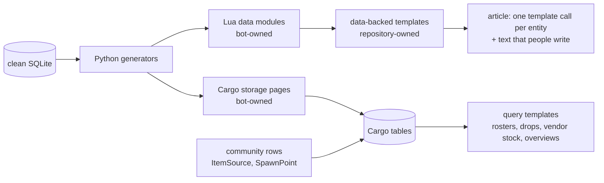

## Context

See `proposal.md` for the motivation. The state on 2026-10-03:

- Live data modules: `Data/Items` with its shards, `Data/Links`, `Data/Skills`, `Data/Spells`, `Data/Stances`, and the retired `Data/AbilityLinks`. `Data/Characters`, `Data/Quests`, and `Data/Zones` do not exist live. `Data/Characters` is 5.1 MB, over the 4 MiB page limit of the wiki.
- Live July code: `Template:Character` switches to a Lua branch when `stablekey` is present and stores Cargo rows there. `Template:Item` has a `lua=1` branch with Cargo stores, and its documentation tells editors to pass `lua=1`. `Module:Erenshor/Cargo`, the July templates `Spell`, `Skill`, `ArmorTable`, `WeaponTable`, and `AbilityClasses`, five store templates, and four query templates exist live. No main-namespace page uses the templates. Only four tooltip pages load any of this code, through `Module:Erenshor/Cargo`.
- Live parameter templates: `Template:Stance`, `Quest`, `Zone`, and `MapLink`. WoWBot deployed their Lua versions on 2026-07-14 and 2026-07-22, and WoWMuch reverted each deploy soon after. Those versions loaded data modules that did not exist live.
- The repository still holds the July code, and the Lua `MapLink` fails live with "module 'Module:Erenshor/Data/Zones' not found". The two old Cargo tables `Item` and `Consumable` are empty.
- `refresh-wiki-articles` is at task 6.2. `publish-wiki-cargo-data` waits for the `cargoadmin` grant. Issues #293 and #294 hold the conversion and the table replacement.
- Contributors have no entry point. The Help namespace is empty, and the project namespace holds the unadapted Fandom `Wiki rules` of 2023 and Kyrros's hand-kept `Potentially Missing Wiki Data` project. The main page's "Contribute" box is the only path to `User:WoWBot`, and it links `Category:Unknown Item Source`, which nothing fills. `User:WoWBot` explains which infobox fields survive a refresh, but its table no longer matches the refresh: it keeps Character `type` and replaces Zone `maplink` and `connects`. The wiki has seven administrators, and Kyrros maintains community templates that no page documents.
- The repository held copies of pages that people edit: the main page with its stylesheet, `MediaWiki:Sidebar`, `Raids`, `Zones`, five mechanics pages, and two images. No command deployed them, and the main page and `Raids` copies were already older than Roan's and LettersWords' live edits. A script under `src/tools/` rewrites the vendor tables of about 54 NPC pages outside `erenshor`, and its output was committed to `wiki/`.

## Goals / Non-Goals

**Goals:**

- One written plan that every later step follows, with the reason for each rule.
- A repository whose wiki pages are all meant to be live, so that deploying every page that differs is the normal and safe operation.
- Checks in the tools for the failures that happened, instead of rules that people must remember.

**Non-Goals:**

- Changing any decision of 2026-10-03. This design records them and adds only what the cleanup needs.
- Designing steps 2 to 4 in detail. Their own changes do that.

## Decisions

### D1. Target architecture

Python computes every fact and relationship from the clean database. Lua data modules feed the renderers that draw infoboxes, tooltips, and links by stable key. Storage pages fill complete Cargo tables, which editors query through documented templates, raw `#cargo_query`, and Special:CargoExport. Community rows join the same tables. Sections that collect data across entities and must show community rows, such as zone rosters and "dropped by", query Cargo.

A game update then deploys data pages and creates stubs for new entities. It edits an article only when the list of entities on the page changes. The spec `wiki-publishing` states this as requirements.

Rules for data pages:

- Never change the structure of a live data page in place. Publish the new structure under a new title, move the readers to it, then remove the old page.
- Each data module stays under the page size limit and is split into shards when it grows.
- After a data deploy: purge the storage pages, compare the row counts with the database, then purge the pages that use query templates (`publish-wiki-cargo-data` D6).

Alternative considered: render articles from Cargo queries only. Rejected on 2026-10-03: Lua data modules invalidate their users automatically when they change, Cargo query results stay cached until a purge, and a table change needs a sysop.

### D2. One owner for each kind of page and input

| Page or input | Owner | Written by |
|---|---|---|
| `Module:Erenshor/Data/*`, `Erenshor Wiki:Cargo/*`, `Template:Cargo/*` | bot | generation and deploy commands only |
| modules, templates, content pages, and gadgets under `wiki/` | repository | `wiki deploy-repo-pages` and `wiki deploy-interface` |
| article text, overrides of owned fields, community rows, hand-written pages, the main page, the sidebar, and the `Erenshor Wiki:Community Portal` | people | editors |

The repository is the source of each repository-owned page. When another account edits such a page, the deploy stops at the drift check (`refresh-wiki-articles` D6), and the edit goes into the repository source. The lock boundary of every write is the revision that the write was planned against. Until step 4 converts a type, its articles are shared: generated parameters and text that people write sit in one page, and the refresh merges them.

The repository keeps no copy of a page that people own. Such a page changes on the wiki, by hand. Once steps 3 and 4 exist, a section of it can become template-maintained: a query template or a data-backed template call that people place in their page. A script or a repository copy never writes into it.

Every template that a generated article calls, directly or through another template, is repository-owned. On 2026-10-04 that added 20 templates that WoWMuch had built on the wiki: the item companions (`Item/General`, `Item/Aura`, `Item/Charm`, `Item/CharmScaling`, `Item/Consumable`, `Item/Mold`, `Item/SkillBook`, `Item/SpellScroll`), the weapon and armor tooltips that `Item/ParameterizedTooltip` expands (`Item/Weapon`, `Item/Armor`) with their parts (`Item/Header`, `Item/Stats`, `Item/Resists`, `Item/Vitals`, `Item/DPS`, `Item/ClassRestrictions`, `Item/Categories`, `Item/SpellDetails`, `SparkleIcon`), and `Zone Navbox`. Their repository text equals the live text, so taking them over changed nothing live. The local wiki then tests the real templates instead of the outdated copies it kept in `wiki-dev/fixtures/dependencies/`.

Each kind of human input has one home:

| Input | Home |
|---|---|
| Game behaviour that the export cannot see | code facts or the export, into the clean database |
| A correction of how the export is read (name, identity, tier) | a `mapping.json` entry with a reason |
| A fact that editors add and other pages need | a Cargo community row |
| Per-page presentation of an owned field | a parameter on the article |
| Prose and strategy | article text |

An article parameter is not a home for a missing fact: only its own page shows it, and the sheets, the map, the mods, and Cargo never see it.

### D3. Roadmap

| Step | Owner | Done when |
|---|---|---|
| 0. Cleanup | this change, task groups 1 to 4 | CI and the local wiki suite pass, and a full repository-page dry run lists only intended pages with a clean render check |
| 1. Refresh | `refresh-wiki-articles` | it is archived after its live checks |
| 2. Cargo | `publish-wiki-cargo-data`, plus a change that models four runtime item mechanics (D11) | both are archived |
| 3. Hand-maintained tables | a change that this plan proposes (task 7.1) | every table listed below renders from a query template |
| 4. Conversion | a change, or one for each type, that this plan proposes (task 8.1) | every type is converted, and the merge engine is deleted |

Step 0 lands before task 6.2, so that 6.2 deploys the cleaned pages once. Step 2 needs the `cargoadmin` grant for `WoWMuch@InterfaceDeploy` at Special:BotPasswords.

Step 3 replaces these tables, found on 2026-10-03: the enemy tables on Port Azure and Abyssal Lake (zone rosters), the vendor tables on NPC pages such as Breena Carpenter, the "Abilities and Spells" tables on the class pages and the Ability Books page, and the Zones and Quests overviews. Editors keep the zone, class, and overview tables by hand. The vendor tables of about 54 NPC pages are written by `src/tools/update_vendor_inventory_tables.py`, a script outside `erenshor` that found 37 of them stale or missing on 2026-07-16. Step 3 replaces them with the `Vendor stock` query template and deletes that script, `src/tools/generate_vendor_inventory_tables.py`, `src/erenshor/tools/vendor_inventory_tables.py`, and their tests. It announces each replacement on the wiki first, keeps the notes that editors wrote (such as the notes column on Zones), and reviews each page, because it changes text that other people wrote.

Step 4 converts one type at a time: Stance, abilities, zones, characters, items. Quest pages stay hand-written and get the Cargo quest panel of step 2. For each type:

1. Generate compact data modules in shards under the size limit.
2. Add the type's data-backed template under a new name. The conversion change decides the names, the owned-field set of each type, and the tracking category for parameters that cannot override data.
3. Parse every page of the type on production with `action=parse`, the legacy text against the converted text, and review each difference.
4. Convert the pages with guarded edits and a rollback manifest.
5. Delete the type's legacy generator code.

Step 4 also has to settle these known points:

- Editor entries in the merged item fields `type`, `questsource`, and `relatedquest` need a home, possibly a community row type.
- 361 character keys contain coordinates. When an update moves such a spawn, its key changes, and the reconciler must edit that page.
- The ability templates emit categories for spells, skills, and stances, which the legacy generator never did (from #110).
- The item template shows `item_db_index`, the ID that the in-game `/additem` command uses (from #113).
- Template:Character shows fewer stats than generation writes: mana, the seven attributes, the XP multiplier, and the level variance stay hidden, and its Base Experience and class rows are never filled. Decided on 2026-10-05 to settle this with the character template of this step.

After the last type, the merge engine (`field_preservation.py` and the passes around it), the Jinja article templates, and the full-article refresh go. The guarded deploy stays for stubs and template-call edits.

The remaining work follows this order, decided on 2026-10-05. Small data fixes come first, because each corrects a live page or an input of a later step: the crafting rule (task 5.21, done the same day), the audit of renamed copies (task 5.20), the export of the chat knowledge base (tasks 5.22 to 5.24), and the forge quantity and guaranteed roll count that task 5.21 brought to light (tasks 5.25 and 5.26). Treasure hunting (tasks 5.29 to 5.32, D16) and the fixes it brought to light follow: the effective stats and start order of NPCs (tasks 5.33 and 5.35), the training dummies (task 5.34, D17), and the Reliquary furnishings (task 5.36, D18). The missing images (task 5.15) and the tooltip check (task 5.19) follow. The C# tooling majors of the dependency dashboard come before step 2, because the code facts of task 6.2 depend on that tooling. Steps 2, 3, and 4 follow, and then the other dependency majors.

The local wiki stack stays on MySQL 8, because the live wiki runs MySQL 8.0.45. A Renovate rule holds the `mysql` image of `wiki-dev/compose.yml` at 8.x.

### D4. Legacy templates become parameter templates

`Template:Item`, `Character`, `Ability`, `Stance`, `Quest`, `Zone`, and `MapLink` keep only their parameter rendering. The repository versions of Stance, Quest, Zone, and MapLink then equal the live pages. `Template:Character` keeps the Elite and Chest tiers that the refresh needs. Item and Character lose their live Lua branches in task 6.2. After that, these templates change only in compatible ways: a fix to how a parameter renders, or a new optional parameter. They never lose or rename a parameter, so hand-written pages that use them keep working. The first such changes are the stance lifesteal fix (task 5.13), the optional lifecycle parameters of task 5.12, and the map row of `Template:Character`, which shows its link only when `zones` has a value, because the map has no marker for a character without a spawn.

The `lua=1` lock of `refresh-wiki-articles` D2 goes with the branches. Without a Lua branch, `stablekey` cannot switch a page to Lua.

Alternatives considered:

- Keep the `lua=1` lock until the conversion. Rejected: the conversion uses new templates, so the branches serve only local test pages. They also kept the old plan alive in code that agents read.
- Move the branches into new templates now. Rejected: the template names and the owned-field sets are decisions of the conversion change, and the July renderers apply every parameter as an override.

### D5. What goes, and why it is safe

| Part | Why it can go now |
|---|---|
| Article Cargo: declarations, stores, store and query templates, `ArmorTable`, `WeaponTable`, `AbilityClasses`, `Module:Erenshor/Cargo`, `cargoStore` entry points, `wiki-dev/cargo_check.py` and its article-row fixtures | No live page stores or queries rows. `publish-wiki-cargo-data` stores rows on storage pages, and its task 3.3 adds the local storage-page checks. |
| Templates `Spell` and `Skill` | No live page uses them. The tooltips call the modules directly. |
| The data path of `Template:ItemTooltip`, `Module:Erenshor/Item`, and `Item/Tooltip` | All 793 item tooltips pass `kind` and render through `Item/ParameterizedTooltip`. The hover cards read the tooltip that is on the target page. No other template calls `Module:Erenshor/Item`. |
| `field`, `status`, and their accessors in the Stance, Spell, and Skill modules | Only the removed Lua branches call them. |
| The application of article parameters over the data in the Stance, Spell, and Skill resolvers | Every caller passes only `stablekey`: 348 Spell, 51 Skill, and 7 Stance tooltips in the generated pages. |
| Character, Quest, and Zone modules and the writers of their data modules | Only the removed branches and `MapLink` call them. The Python repositories stay, because item provenance, spell relationships, and the link catalog read them. |
| `override_classifier.py`, `override_migration.py`, `wiki review-overrides` | They implement the July rule that every differing value is an override, which D2 replaces. |
| `src/erenshor/tools/wiki_cargo_probe/` | It tested the July article storage. No task of the Cargo change uses it. |
| `wiki-dev` pages that pass `lua=1` | They test only the removed branches. |
| `wiki inventory-templates`, `src/erenshor/application/wiki_inventory/`, and `wiki/ownership.yml` | The inventory was the readiness checklist of the July cutover, with a `cutover_blocking` flag on each template. Nothing reads it. The data guide of D12 lists the repository's templates from `wiki/templates/`. |
| The copies of people-owned pages: `wiki/Erenshor_Wiki.txt`, `wiki/Erenshor_Wiki.styles.css`, `wiki/MediaWiki_Sidebar.txt`, `wiki/Raids.txt`, `wiki/Zones.txt`, `wiki/mechanics/` with its images, and `wiki/images/` | No command deploys them, and two were already older than the live pages. The live pages are the source. The two unpublished mechanics drafts, `Critical Strikes` and `Chant Control and Resonance`, are dropped on 2026-10-04, and the history keeps them. |
| `wiki-dev/fixtures/dependencies/`, and the generator templates `weapon.jinja2` and `armor.jinja2` | The fixture copies of 11 item templates all differed from live, and the repository now owns the real templates. Nothing renders the two Jinja templates: weapon and armor pages get `ItemTooltip` with `kind`. |

What stays: `Item/ParameterizedTooltip`, `Item/Quality`, `Ability/Common`, the Spell, Skill, and Stance tooltip paths, `Link`, `Link/Search`, `AbilityLink`, `Format`, `Args`, and the data modules that links and tooltips read (`Data/Items` with its shards, `Data/Links`, `Data/Skills`, `Data/Spells`, `Data/Stances`). Step 4 builds the new renderers and can reuse removed code from the history.

Until step 3 deletes it, the vendor script writes its report to `variants/<variant>/wiki/` instead of `wiki/`, because the repository does not track generated output.

### D6. Dependency check before a repository-page deploy

Before any write, `wiki deploy-repo-pages` reads the dependencies of each module and template in the run: `{{#invoke:X|` in wikitext, and `require` and `mw.loadData` with a literal title in Lua. It follows each dependency through the run's new text, or through the live text when the run does not write that page. A page whose dependency is neither live nor written earlier in the run is blocked, together with every page that depends on it. Modules are written in dependency order inside their stage.

Dynamic titles, such as the item shards that `Link.lua` builds from a name, cannot be read statically. The render check of D7 covers them.

### D7. Render check before a repository-page write

For each module or template that the run writes, the check:

1. Lists the main-namespace pages that use it, with `list=embeddedin` and continuation, and reads their live text in batches of 50.
2. Selects pages. By default it takes, in title order, the page that covers the most uncovered features until every feature is covered. A feature is a template called on the page, a filled parameter of such a call, a `type` or `kind` value, or an entity kind and subtype that a `stablekey` on the page names in the link catalog. On request, it selects every page.
3. Parses each selected page twice through `action=parse` with the page's text: once as it is, and once with `templatesandboxtitle` and `templatesandboxtext` set to the new text. Text parses are used because a page parse can serve a cached `mw.loadData` result.
4. Blocks the page when the new parse has a script error or a missing template that the live parse does not have.
5. Reports each selected page whose visible text or categories differ, with the removed and added lines.

Measured on the generated pages of 2026-10-03, the default selection holds 65 of the 1,507 pages that use `Template:Item`, 11 of 875 for `Template:Character`, 18 of 792 for `Template:ItemTooltip`, 21 of 335 for `Template:SpellTooltip`, and 99 of 2,726 for the link module. The 6.2 deploy then needs about 500 requests, about ten minutes. A full check of every page needs about 4.5 hours.

The real deploy runs the check directly before each write, so later stages see the pages that the run already wrote. A dry run checks against the current live wiki. When a page depends on another page of the same run, the dry run marks its result as provisional. A module change must keep the live templates working, because its check runs against them. The first blocked page stops the run, and the run fails and names the page and the selected page that failed.

Alternatives considered:

- Sandbox many pages at once with `templatesandboxprefix`. Rejected: it needs copies of each page written on the wiki first.
- Rely on the local MediaWiki stack. Rejected: it holds every generated data module, so it cannot see a module that is missing live. That gap hid the `Data/Zones` failure.

### D8. Size limit at generation

`wiki generate-lua` compares the UTF-8 size of each module with `max_page_bytes` in the `[global.mediawiki]` section of `config.toml`, 4,194,304 bytes for erenshor.wiki.gg (the `maxarticlesize` that the wiki reports). It fails with the module name and size when a module is larger. Without this check, the deploy would fail only after it had written the earlier pages of the run.

### D9. Where the plan is written

- This change holds the plan: the target, the rules with their reasons, the roadmap, the wiki work that has not started (D11), and its progress in `tasks.md`.
- OpenSpec is the only tracker for wiki work. Wiki work waits in this change until its own change exists. GitHub issues are not used for wiki work. Issues of other areas can stay on GitHub until their work starts.
- `README.md` describes the wiki in a few lines and links this change.
- `.agent/skills/wiki-templates/SKILL.md` gives agents the binding rules and the procedures, and links this change. It holds no history.
- `openspec/config.yaml` names this change in its context, so that every OpenSpec workflow sees it. Its design rules about dependency ecosystems become general rules.
- No other plan document exists. When a decision changes, this change changes in the same commit as the code.
- `Erenshor Wiki:Game Data` (D12) explains the data, the ownership rules, and the procedures to editors. It describes the current state and holds no plan.

### D10. Live writes and deletions

Every live write needs approval after a dry run and the render check of D7. The bot cannot delete pages. Task group 9 lists the live pages that only an administrator can delete, each with the condition for its deletion. A task is checked when the page is gone. `Module:Erenshor/Cargo`, for example, can go after task 6.2 of `refresh-wiki-articles` deploys the Spell, Skill, and Stance modules without it.

### D11. Wiki work moved from GitHub issues

Each of the 19 open wiki issues was checked on 2026-10-03 against the code, the clean database, the generated pages, and the live wiki.

| Issue | Finding | Where it goes |
|---|---|---|
| #293, #294 | current decisions | D3, steps 4 and 3 |
| #115 Cargo setup | superseded | `publish-wiki-cargo-data` |
| #288 quest strategy | decided on 2026-10-03 | D3: quest pages stay hand-written, with the Cargo quest panel |
| #285 deferred item mechanics | the global world-drop pool is modeled. Smithing merge and Planar Shard blessing removal are `ItemUses` of `publish-wiki-cargo-data` task 5.4. Four are open: the Chessboard Candlekeeper mold conversion (`Chessboard.cs:107-112`), the Time Stone scene gate (`SpellVessel.cs:2277-2284`), the Braxonian Flame Well quality ritual (`TradeWindow.cs:175-255`, called at line 321), and the 1-in-20 fished Map (`Fishing.cs:69-74`) | a change that adds code facts and processor mappings for the four, before `ItemSources` and `ItemUses` go live (task 6.2) |
| #299 zone categories | four generated zone categories are redirects and six have no page | categories use the zone page titles (task 3.4) |
| #110 categories | item and character categories exist. Spell, skill, and stance pages get none | D3, step 4 |
| #113 item ID | `items.item_db_index` exists, no page shows it | D3, step 4 |
| #97, #98 old images | `SpellScrollPurple.png` has four users, `SpellScrollYellow.png` one, four other `SpellScroll*` files and `Kingsman_GP.png` none | task group 9 |
| #106, #107 | done: the pages show zone, coordinates, and trigger | closed |
| #112 | stale: charm resist values match `Item.CalcResists` | closed |
| #114 | done: the Game Board page is complete and cross-linked | closed |
| #144 | done: the AdventureGuide mod and the Quests index | closed |
| #139 | its work is the export of zone-wide random spawners, issue #282 | closed as a duplicate of #282 |
| #91, #105, #291 | not part of this plan | stay on GitHub |

### D12. One entry point for contributors

Two pages, with one owner each. The PoE, WARFRAME, and Abiotic Factor wikis use the same split: a community portal that links everything, and a separate guide to the data pipeline.

- `Erenshor Wiki:Community Portal`, owned by people, is the entry point. It covers getting started, the rules and conventions (with the community templates that Kyrros maintains), things to do (wanted pages, the `Potentially Missing Wiki Data` project, the maintenance categories), discussion (its talk page and Discord `#wiki-chat`), the administrators, and a link to the data guide. A first version is drafted, reviewed by WoWMuch, and created from WoWMuch's account. After that, the community owns it, and the repository keeps no copy.
- `Erenshor Wiki:Game Data`, owned by the repository (`wiki/content/Erenshor Wiki/Game Data.wiki`), is the data guide. It covers how data moves from the game build to the wiki and which build is live, who owns which pages (D2 in the words of an editor), the fields of each generated template that keep an editor's value at a refresh, where a fact that the export misses goes, how to report wrong data, the semantic link templates with the link picker and the tooltips, and the maintenance categories with what to do about each. `Erenshor Wiki:Cargo` of `publish-wiki-cargo-data` becomes its child page.
- Reports of wrong data go to Discord `#wiki-chat` for discussion and to the talk page of `Erenshor Wiki:Game Data` as the record. Confirmed work moves into OpenSpec.
- `User:WoWBot` becomes a short card: what the bot is, who runs it, and a link to the data guide. The field table then exists only in the guide.
- The sidebar gets a "Community" group with the portal, the data guide, and the wiki rules. The main page's "Contribute" box links the portal and no longer links `Category:Unknown Item Source`. People own both pages, so WoWMuch makes these edits.

The guide must not go stale the way `User:WoWBot` did:

- A contract test compares the guide's field table with the preservation rules of the generator, so a rule change without a guide change fails CI. In step 4, the table and the test move to the owned fields of the data-backed templates.
- The game build comes from a generated data module, `Module:Erenshor/Data/Build`, which holds `game_build_id` and its publish date from `code_facts_meta`. `Module:Erenshor/Build` renders it. A data deploy updates the module, so the guide shows the new build without an edit. The data-backed templates of step 4 name their build from the same module.
- Each maintenance category page says what an editor does about a page in it, for example: add a `stablekey` with the link picker.

After the refresh, the bot has created most of the item, character, and zone pages that Kyrros's project lists. On 2026-10-04 it was decided not to contact Kyrros about this. His project page stays as it is, and this plan generates no list of missing pages.

Both pages land before task 6.4 of `refresh-wiki-articles`. The refresh changes about 2,700 articles, and editors who look for an explanation must find a correct one.

Alternatives considered:

- One repository-owned hub. Rejected: a portal holds text that people write, so the repository cannot own it, and every edit by another administrator would stop the next deploy.
- Keep `User:WoWBot` as the guide. Rejected: a bot's user page is not where editors look, and the main page is its only link.

### D13. Request pacing follows the wiki

Every MediaWiki request goes through one requestor, which is the only owner of pacing. It sends requests one at a time with `maxlag`, as the [MediaWiki API etiquette](https://www.mediawiki.org/wiki/API:Etiquette) asks. Reads get no artificial delay. An action that the wiki rate-limits for the account, such as `edit` or `purge`, is spaced by the limit that the wiki reports after login (`meta=userinfo&uiprop=ratelimits`) with a margin of 10 percent. On 2026-10-04 WoWBot had 90 edits and 30 purges per 60 seconds and no `noratelimit` right. An account with `noratelimit` gets no spacing. A `ratelimited` or `maxlag` response still backs off and retries.

Before this decision, the requestor waited 1 second before every request, reads included, and the article deploy slept 2 more seconds after each write. A refresh of 2,700 articles took about 2 hours. It now takes about 40 minutes, which the edit limit sets. The configuration keys `api_delay`, `upload_delay`, and `api_batch_size` and the option `--rate-limit-delay` go, because the wiki's own limits replace them. `upload_batch_size` stays, as the page batch of the API reads.

Alternative considered: keep fixed delays and lower them. Rejected: a fixed number is a guess that is too slow for one account and too fast for another, and it does not follow when the wiki changes its limits.

### D14. Tooltips show what the game shows

A wiki tooltip shows the lines of the game window that it copies: the item window, the skill book, or the spell details window. A difference is a defect, with three exceptions that the wiki keeps on purpose:

- An equipment tooltip shows a card for each quality, where the game shows one card for the item in hand.
- Damage over time reads `/ 3 sec`, where the game reads `/ tick`. The wiki states times in seconds (decided on 2026-06-06).
- `Base DPS` is the weapon damage divided by the delay. The game value also uses the stats and the level of the player, so no single number on a page can equal it.

A stance has no icon in the game. The skill book shows the icon of the skill that switches to the stance, and the stance page uses that icon. Generation derives it from the skill and owns it on the page, because no person chooses it. A stance that no skill switches to cannot be entered and gets no page. Reckless is the only such stance: the Planar March update (2026-07-13) removed its skill, and `SkillDB.RecklessStance` is never read.

On 2026-10-04 a check in the game found six defects: a bow label that also doubled the bow DPS, no `Range 1` on melee weapons, no `Must Equip to Cast`, no item value, no percent sign on haste, and a stance lifesteal multiplier shown as a percentage. Tasks 5.5 to 5.9 and 5.13 fix them.

Hover tooltips open beside their link. On 2026-10-04 a comparison with Wowhead, warcraft.wiki.gg, the Path of Exile and Minecraft wikis, MediaWiki Page Previews, and the Afallon compendium showed three placements. A card below the link covers the next rows of a drop table, a card that follows the cursor covers its neighbours, and a card beside the link covers neither. The delay of 300 ms stays, because it lies in the usual range (Page Previews waits about 500 ms). None of the compared game wikis supports the keyboard or assistive technology, so the gadget keeps its own support and the spec states it.

### D15. Characters that the game shows under other names

A built scene keeps no link to the prefab that a placed character came from. An audit that looks only for references to a prefab therefore reports a renamed scene copy as an unused prefab. On 2026-10-04 this made three of nine pages look unused: `An Angry Spirit` and `Dream Invader` name characters that the game places under other names, and both `Watchman` prefabs are in Shivering Step as `Bridgekeeper` and `Gatekeeper`.

Simulated-player chat is a second way that the game shows a name. Its knowledge base, the asset `KnowledgeDatabaseHolder` of type `KnowledgeDatabaseAsset`, holds an entry with a name, zone, level, boss flag, and drops for each NPC prefab that existed when it was last built. The game never rebuilds it. On build 24405256, one of its 892 entries stores a prefab file name that was renamed since, and 59 lack drops that their characters gained later. Chat names an entry without being asked when the entry has a zone, because random guild questions pick only such entries. Chat also names it as the source of an item when it is the first entry that drops the item. Chat names any entry when a player asks for it by name.

The knowledge base is what chat says, not a description of the characters. The export keeps it as the game ships it and corrects nothing. No other clean table reads it, so drops, levels, and zones still come from the prefabs and loot tables. Each entry keeps only the file name of its prefab, so the clean database links it to every prefab character with that object name, NPC name, and level. Four pairs of twin prefabs link both keys. A stale entry still counts for the chat sentence, because chat still says it. The audit reports the drift for review, and the drift that players can see goes to the developer as a report (decided on 2026-10-05).

After each game update, the audit compares both sources with the placed characters. It lists each dead prefab with the placed characters that share its object name, and each name that chat can say without being asked but that no wiki-visible character carries. A reviewer then records a rename, a split, or an unused page in `content-lifecycle.json`. The chat sentence of an unused notice follows from the knowledge base, not from a hand-set flag.

### D16. Treasure hunting

Reading a treasure map picks a zone from a pool that grows with the reading level: three zones, six above level 20, and nine above level 30. Digging at the marked site spawns one of four chests, chosen by the level at the time of digging: below 10, 10 to 19, 20 to 29, and 30 or more. Each strike on the chest spawns a wave of 3 or 4 guardians, and `TreasureChestEvent.SetGuardianStats` sets their level, health, attack, and swing delay from the striking player's level. `NPC.Start` and `Stats.Start` then run as for any NPC. These rules are assert code facts.

Both `Start` methods have the default execution order, so the order in which Unity creates the components decides which runs first. That order decides which level the resists and the attack floor see, and whether `DamageBalanceFactor` applies before or after the floor. Checked in game on 2026-10-05, it depends on how the character comes alive:

- A prefab that a spawn point or an event instantiates starts its components in the order of the GameObject's component list. With the level set to 20 and the attack to 0 before `Start`, three guardians and four ordinary prefabs of both orders reached the predicted attack in 46 spawns, and four unmodified prefabs in 24 more. On build 24405256, 784 prefabs list `Stats` first and 274 list `NPC` first.
- A scene character that is active when its scene loads starts its components in the order of their local file IDs, which AssetRipper keeps from the build and which differs from the component list for 163 of 300 such characters. Six NPCs of Stowaway, among them Staggy Garth and Amethi Plazzo, whose file IDs and lists disagree, reached the attack of their file ID order.
- A scene character that starts inactive and is activated later, as a claimed room of the Reliquary is, starts its components in the reverse order of their file IDs. The Braxonian Flame Well, a pocket vendor whose file IDs and list disagree, and the training dummies of both orders behaved so.

The export records the component list, the file ID order, and whether a scene character is active at load, and the clean build derives the start order from them.

Decided on 2026-10-05:

- The map shows the encounter on the 55 dig sites: the chest by digging level, the reading level a map needs to point there, and the three guardians with wiki links. Searching a chest or guardian name, or the wiki's map link, highlights the dig sites. The guardians get no rows in `character_spawns`, so the AdventureGuide gets no targets that the player cannot find. The map's level filter keeps a dig site when a guardian there can have a level in the range.
- The guardians' infoboxes list the zones of the treasure data with the spawn type `[[Treasure Hunting|Treasure hunt]]` and the level "Scales with the player's level". Their stats come from `treasure_guardian_scaling`, which the clean build computes by guardian and player level 1 to 35, published as a data module that one shared template renders on the three pages. This replaces formulas in Lua, so the game formulas are re-implemented once.
- A guarded one-time edit corrects the chest pages, which tie the chest to the reading level, and another replaces the legacy `{{Enemy}}` and `{{Enemy Stats}}` blocks of the guardian pages.

### D17. Training dummies

A training dummy carries a `TestDummy` component beside `NPC` and `Stats`. `TestDummy.Start` sets the dummy's level to the player's level when it is below 42 and to 42 when it is above, recomputes its stats, and gives it its hand-set AC. `TestDummy.FixedUpdate` keeps the level at the player's level. The hand-set AC returns when a DPS recording starts and when the dummy resets after one, and `Stats.CalcStats` replaces it with 15 × the level whenever a status effect lands on the dummy or wears off. These rules are assert code facts.

`NPC.Start` and `Stats.Start` see the prefab level when they start before `TestDummy` and the player's level when they start after it, in the start order of D16. A stat that one of them computes from the player's level has no fixed value, and the clean database leaves it empty. In game on 2026-10-05, at player levels 5 and 20, the Stone Training dummies, which start `TestDummy` first, had 143,000,000 and 227,499,984 health, and the Wood Training dummy, which starts `NPC` first, had 143,000,000 at both.

Decided on 2026-10-05:

- The wiki and the map name each kind by its hand-set AC: Training Dummy, Training Dummy (400 AC), Training Dummy (800 AC), and Training Dummy (1000 AC). The game calls every dummy Training Dummy when it starts, and only the 400 and 800 AC kinds carry their AC in their NPC name.
- The infobox shows "Scales with the player's level" as the level, the health only where it is fixed, and the AC with when it applies, as 15 × the player's level where no hand-set AC applies. The map shows the level the same way. Dummies are NPC markers, which the level filter never hides.
- `characters.level_scales_with_player` marks every character whose level the game sets from the player's level, the treasure guardians of D16 included, so that the wiki and the map read one flag.

### D18. Reliquary furnishings

The Reliquary has 8 rooms. At its planning table the player puts one furniture set into each room, and `PlanningTable.CheckRoomAndBuild` turns on the child of the room whose name is the set's `EquipmentToActivate`. Every room has the same children, so each furnishing NPC can stand at its spot in any of the 8 rooms. Until 2026-10-05, 94 mapping entries without reasons showed some furnishings in all 8 rooms, others in one, and the Braxonian Flame Well in none.

Decided on 2026-10-05: the export records which planning-table room and furnishing hold each scene character, and the clean build links the furnishing to its furniture item. Every furnishing NPC appears at its spot in all 8 rooms, like the dig sites of D16, and the map popup and the infobox say that it appears when the player places the linked furniture set in a room. A rule replaces the 94 entries.

### Failure handling and update grouping

- The dependency check, the render check, and the size check fail closed. They name the page and the cause, and a dry run reports the same result without writing.
- A deploy writes in stages: generated data, modules in dependency order, templates, and content pages. Each write is guarded by its planned revision and recorded in the rollback manifest.
- This change does not change branch protection or CI requirements.

## Risks / Trade-offs

- [Step 4 loses tested renderer code] → The history keeps it. The removal commit names the last revision that has it.
- [The `Template:Item` deploy reparses about 1,500 pages] → The render check must show no visible change before the write. The job queue spreads the reparse.
- [The default selection misses an error that one unusual data entry triggers] → A full check is one option away. Each article deploy still parses every page before it writes it (`refresh-wiki-articles` D5). Scribunto testcases and the local stack cover the modules.
- [Coupled changes give provisional dry-run results] → The real deploy checks each page again directly before its write, after the pages it depends on.
- [Article Cargo goes before the Cargo change stores anything] → No live page stores or queries rows today, so no data is lost.
- [This change stays open for months, and its spec reaches `openspec/specs/` only at the end] → The skill, the README, and `openspec/config.yaml` link it, and `tasks.md` shows the progress.

## Migration Plan

1. Land the cleanup commits of task groups 1 to 3. They write nothing live.
2. Move the issue work into OpenSpec and close the issues (task 3.3).
3. Resume `refresh-wiki-articles` at task 6.2. Its deploy writes the cleaned pages after approval.
4. Continue with steps 2 to 4.

Rollback: repository commits revert in git. Live writes roll back through their manifests (`wiki rollback-repo-pages`). An administrator can restore a deleted page.

## Open Questions

- The names of the new data-backed templates, and the name of the tracking category for parameters that cannot override data. The conversion change decides both. Neither changes the specs or the tasks of this change.
