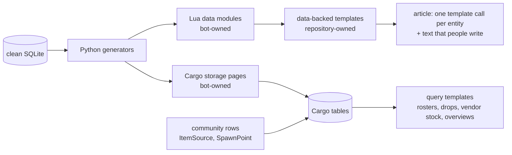

## Context

See `proposal.md` for the motivation. The state on 2026-10-03:

- Live data modules: `Data/Items` with its shards, `Data/Links`, `Data/Skills`, `Data/Spells`, `Data/Stances`, and the retired `Data/AbilityLinks`. `Data/Characters`, `Data/Quests`, and `Data/Zones` do not exist live. `Data/Characters` is 5.1 MB, over the 4 MiB page limit of the wiki.
- Live July code: `Template:Character` switches to a Lua branch when `stablekey` is present and stores Cargo rows there. `Template:Item` has a `lua=1` branch with Cargo stores, and its documentation tells editors to pass `lua=1`. `Module:Erenshor/Cargo`, the July templates `Spell`, `Skill`, `ArmorTable`, `WeaponTable`, and `AbilityClasses`, five store templates, and four query templates exist live. No main-namespace page uses the templates. Only four tooltip pages load any of this code, through `Module:Erenshor/Cargo`.
- Live parameter templates: `Template:Stance`, `Quest`, `Zone`, and `MapLink`. WoWBot deployed their Lua versions on 2026-07-14 and 2026-07-22, and WoWMuch reverted each deploy soon after. Those versions loaded data modules that did not exist live.
- The repository still holds the July code, and the Lua `MapLink` fails live with "module 'Module:Erenshor/Data/Zones' not found". The two old Cargo tables `Item` and `Consumable` are empty.
- `refresh-wiki-articles` is at task 6.2. `publish-wiki-cargo-data` waits for the `cargoadmin` grant. Issues #293 and #294 hold the conversion and the table replacement.

## Goals / Non-Goals

**Goals:**

- One written plan that every later step follows, with the reason for each rule.
- A repository whose wiki pages are all meant to be live, so that deploying every page that differs is the normal and safe operation.
- Checks in the tools for the failures that happened, instead of rules that people must remember.

**Non-Goals:**

- Changing any decision of 2026-10-03. This design records them and adds only what the cleanup needs.
- Designing steps 2 to 4 in detail. Their own changes do that.

## Decisions

### D1. Target architecture

Python computes every fact and relationship from the clean database. Lua data modules feed the renderers that draw infoboxes, tooltips, and links by stable key. Storage pages fill complete Cargo tables, which editors query through documented templates, raw `#cargo_query`, and Special:CargoExport. Community rows join the same tables. Sections that collect data across entities and must show community rows, such as zone rosters and "dropped by", query Cargo.

A game update then deploys data pages and creates stubs for new entities. It edits an article only when the list of entities on the page changes. The spec `wiki-publishing` states this as requirements.

Rules for data pages:

- Never change the structure of a live data page in place. Publish the new structure under a new title, move the readers to it, then remove the old page.
- Each data module stays under the page size limit and is split into shards when it grows.
- After a data deploy: purge the storage pages, compare the row counts with the database, then purge the pages that use query templates (`publish-wiki-cargo-data` D6).

Alternative considered: render articles from Cargo queries only. Rejected on 2026-10-03: Lua data modules invalidate their users automatically when they change, Cargo query results stay cached until a purge, and a table change needs a sysop.

### D2. One owner for each kind of page and input

| Page or input | Owner | Written by |
|---|---|---|
| `Module:Erenshor/Data/*`, `Erenshor Wiki:Cargo/*`, `Template:Cargo/*` | bot | generation and deploy commands only |
| modules, templates, content pages, and gadgets under `wiki/` | repository | `wiki deploy-repo-pages` and `wiki deploy-interface` |
| article text, overrides of owned fields, community rows, hand-written pages | people | editors |

The repository is the source of each repository-owned page. When another account edits such a page, the deploy stops at the drift check (`refresh-wiki-articles` D6), and the edit goes into the repository source. The lock boundary of every write is the revision that the write was planned against. Until step 4 converts a type, its articles are shared: generated parameters and text that people write sit in one page, and the refresh merges them.

Each kind of human input has one home:

| Input | Home |
|---|---|
| Game behaviour that the export cannot see | code facts or the export, into the clean database |
| A correction of how the export is read (name, identity, tier) | a `mapping.json` entry with a reason |
| A fact that editors add and other pages need | a Cargo community row |
| Per-page presentation of an owned field | a parameter on the article |
| Prose and strategy | article text |

An article parameter is not a home for a missing fact: only its own page shows it, and the sheets, the map, the mods, and Cargo never see it.

### D3. Roadmap

| Step | Owner | Done when |
|---|---|---|
| 0. Cleanup | this change, task groups 1 to 4 | CI and the local wiki suite pass, and a full repository-page dry run lists only intended pages with a clean render check |
| 1. Refresh | `refresh-wiki-articles` | it is archived after its live checks |
| 2. Cargo | `publish-wiki-cargo-data`, plus a change that models four runtime item mechanics (D11) | both are archived |
| 3. Hand-maintained tables | a change that this plan proposes (task 7.1) | every table listed below renders from a query template |
| 4. Conversion | a change, or one for each type, that this plan proposes (task 8.1) | every type is converted, and the merge engine is deleted |

Step 0 lands before task 6.2, so that 6.2 deploys the cleaned pages once. Step 2 needs the `cargoadmin` grant for `WoWMuch@InterfaceDeploy` at Special:BotPasswords.

Step 3 replaces these hand-maintained tables, found on 2026-10-03: the enemy tables on Port Azure and Abyssal Lake (zone rosters), the vendor tables on NPC pages such as Breena Carpenter (37 of 54 were stale or missing on 2026-07-16), the "Abilities and Spells" tables on the class pages and the Ability Books page, and the Zones and Quests overviews. It announces each replacement on the wiki first, keeps the notes that editors wrote (such as the notes column on Zones), and reviews each page, because it changes text that other people wrote.

Step 4 converts one type at a time: Stance, abilities, zones, characters, items. Quest pages stay hand-written and get the Cargo quest panel of step 2. For each type:

1. Generate compact data modules in shards under the size limit.
2. Add the type's data-backed template under a new name. The conversion change decides the names, the owned-field set of each type, and the tracking category for parameters that cannot override data.
3. Parse every page of the type on production with `action=parse`, the legacy text against the converted text, and review each difference.
4. Convert the pages with guarded edits and a rollback manifest.
5. Delete the type's legacy generator code.

Step 4 also has to settle these known points:

- Editor entries in the merged item fields `type`, `questsource`, and `relatedquest` need a home, possibly a community row type.
- 361 character keys contain coordinates. When an update moves such a spawn, its key changes, and the reconciler must edit that page.
- The ability templates emit categories for spells, skills, and stances, which the legacy generator never did (from #110).
- The item template shows `item_db_index`, the ID that the in-game `/additem` command uses (from #113).

After the last type, the merge engine (`field_preservation.py` and the passes around it), the Jinja article templates, and the full-article refresh go. The guarded deploy stays for stubs and template-call edits.

### D4. Legacy templates become parameter templates

`Template:Item`, `Character`, `Ability`, `Stance`, `Quest`, `Zone`, and `MapLink` keep only their parameter rendering. The repository versions of Stance, Quest, Zone, and MapLink then equal the live pages. `Template:Character` keeps the Elite and Chest tiers that the refresh needs. Item and Character lose their live Lua branches in task 6.2. After that, these templates do not change again, so hand-written pages that use them keep working.

The `lua=1` lock of `refresh-wiki-articles` D2 goes with the branches. Without a Lua branch, `stablekey` cannot switch a page to Lua.

Alternatives considered:

- Keep the `lua=1` lock until the conversion. Rejected: the conversion uses new templates, so the branches serve only local test pages. They also kept the old plan alive in code that agents read.
- Move the branches into new templates now. Rejected: the template names and the owned-field sets are decisions of the conversion change, and the July renderers apply every parameter as an override.

### D5. What goes, and why it is safe

| Part | Why it can go now |
|---|---|
| Article Cargo: declarations, stores, store and query templates, `ArmorTable`, `WeaponTable`, `AbilityClasses`, `Module:Erenshor/Cargo`, `cargoStore` entry points, `wiki-dev/cargo_check.py` and its article-row fixtures | No live page stores or queries rows. `publish-wiki-cargo-data` stores rows on storage pages, and its task 3.3 adds the local storage-page checks. |
| Templates `Spell` and `Skill` | No live page uses them. The tooltips call the modules directly. |
| The data path of `Template:ItemTooltip`, `Module:Erenshor/Item`, and `Item/Tooltip` | All 793 item tooltips pass `kind` and render through `Item/ParameterizedTooltip`. The hover cards read the tooltip that is on the target page. No other template calls `Module:Erenshor/Item`. |
| `field`, `status`, and their accessors in the Stance, Spell, and Skill modules | Only the removed Lua branches call them. |
| The application of article parameters over the data in the Stance, Spell, and Skill resolvers | Every caller passes only `stablekey`: 348 Spell, 51 Skill, and 7 Stance tooltips in the generated pages. |
| Character, Quest, and Zone modules and the writers of their data modules | Only the removed branches and `MapLink` call them. The Python repositories stay, because item provenance, spell relationships, and the link catalog read them. |
| `override_classifier.py`, `override_migration.py`, `wiki review-overrides` | They implement the July rule that every differing value is an override, which D2 replaces. |
| `src/erenshor/tools/wiki_cargo_probe/` | It tested the July article storage. No task of the Cargo change uses it. |
| `wiki-dev` pages that pass `lua=1` | They test only the removed branches. |

What stays: `Item/ParameterizedTooltip`, `Item/Quality`, `Ability/Common`, the Spell, Skill, and Stance tooltip paths, `Link`, `Link/Search`, `AbilityLink`, `Format`, `Args`, and the data modules that links and tooltips read (`Data/Items` with its shards, `Data/Links`, `Data/Skills`, `Data/Spells`, `Data/Stances`). Step 4 builds the new renderers and can reuse removed code from the history.

### D6. Dependency check before a repository-page deploy

Before any write, `wiki deploy-repo-pages` reads the dependencies of each module and template in the run: `{{#invoke:X|` in wikitext, and `require` and `mw.loadData` with a literal title in Lua. It follows each dependency through the run's new text, or through the live text when the run does not write that page. A page whose dependency is neither live nor written earlier in the run is blocked, together with every page that depends on it. Modules are written in dependency order inside their stage.

Dynamic titles, such as the item shards that `Link.lua` builds from a name, cannot be read statically. The render check of D7 covers them.

### D7. Render check before a repository-page write

For each module or template that the run writes, the check:

1. Lists the main-namespace pages that use it, with `list=embeddedin` and continuation, and reads their live text in batches of 50.
2. Selects pages. By default it takes, in title order, the page that covers the most uncovered features until every feature is covered. A feature is a template called on the page, a filled parameter of such a call, a `type` or `kind` value, or an entity kind and subtype that a `stablekey` on the page names in the link catalog. On request, it selects every page.
3. Parses each selected page twice through `action=parse` with the page's text: once as it is, and once with `templatesandboxtitle` and `templatesandboxtext` set to the new text. Text parses are used because a page parse can serve a cached `mw.loadData` result.
4. Blocks the page when the new parse has a script error or a missing template that the live parse does not have.
5. Reports each selected page whose visible text or categories differ, with the removed and added lines.

Measured on the generated pages of 2026-10-03, the default selection holds 65 of the 1,507 pages that use `Template:Item`, 11 of 875 for `Template:Character`, 18 of 792 for `Template:ItemTooltip`, 21 of 335 for `Template:SpellTooltip`, and 99 of 2,726 for the link module. The 6.2 deploy then needs about 500 requests, about ten minutes. A full check of every page needs about 4.5 hours.

The real deploy runs the check directly before each write, so later stages see the pages that the run already wrote. A dry run checks against the current live wiki. When a page depends on another page of the same run, the dry run marks its result as provisional. A module change must keep the live templates working, because its check runs against them. The first blocked page stops the run, and the run fails and names the page and the selected page that failed.

Alternatives considered:

- Sandbox many pages at once with `templatesandboxprefix`. Rejected: it needs copies of each page written on the wiki first.
- Rely on the local MediaWiki stack. Rejected: it holds every generated data module, so it cannot see a module that is missing live. That gap hid the `Data/Zones` failure.

### D8. Size limit at generation

`wiki generate-lua` compares the UTF-8 size of each module with `max_page_bytes` in the `[global.mediawiki]` section of `config.toml`, 4,194,304 bytes for erenshor.wiki.gg (the `maxarticlesize` that the wiki reports). It fails with the module name and size when a module is larger. Without this check, the deploy would fail only after it had written the earlier pages of the run.

### D9. Where the plan is written

- This change holds the plan: the target, the rules with their reasons, the roadmap, the wiki work that has not started (D11), and its progress in `tasks.md`.
- OpenSpec is the only tracker for wiki work. Wiki work waits in this change until its own change exists. GitHub issues are not used for wiki work. Issues of other areas can stay on GitHub until their work starts.
- `README.md` describes the wiki in a few lines and links this change.
- `.agent/skills/wiki-templates/SKILL.md` gives agents the binding rules and the procedures, and links this change. It holds no history.
- `openspec/config.yaml` names this change in its context, so that every OpenSpec workflow sees it. Its design rules about dependency ecosystems become general rules.
- No other plan document exists. When a decision changes, this change changes in the same commit as the code.

### D10. Live writes and deletions

Every live write needs approval after a dry run and the render check of D7. The bot cannot delete pages. Task group 9 lists the live pages that only an administrator can delete, each with the condition for its deletion. A task is checked when the page is gone. `Module:Erenshor/Cargo`, for example, can go after task 6.2 of `refresh-wiki-articles` deploys the Spell, Skill, and Stance modules without it.

### D11. Wiki work moved from GitHub issues

Each of the 19 open wiki issues was checked on 2026-10-03 against the code, the clean database, the generated pages, and the live wiki.

| Issue | Finding | Where it goes |
|---|---|---|
| #293, #294 | current decisions | D3, steps 4 and 3 |
| #115 Cargo setup | superseded | `publish-wiki-cargo-data` |
| #288 quest strategy | decided on 2026-10-03 | D3: quest pages stay hand-written, with the Cargo quest panel |
| #285 deferred item mechanics | the global world-drop pool is modeled. Smithing merge and Planar Shard blessing removal are `ItemUses` of `publish-wiki-cargo-data` task 5.4. Four are open: the Chessboard Candlekeeper mold conversion (`Chessboard.cs:107-112`), the Time Stone scene gate (`SpellVessel.cs:2277-2284`), the Braxonian Flame Well quality ritual (`TradeWindow.cs:156-239`), and the 1-in-20 fished Map (`Fishing.cs:69-74`) | a change that adds code facts and processor mappings for the four, before `ItemSources` and `ItemUses` go live (task 6.2) |
| #299 zone categories | four generated zone categories are redirects and six have no page | categories use the zone page titles (task 3.4) |
| #110 categories | item and character categories exist. Spell, skill, and stance pages get none | D3, step 4 |
| #113 item ID | `items.item_db_index` exists, no page shows it | D3, step 4 |
| #97, #98 old images | `SpellScrollPurple.png` has four users, `SpellScrollYellow.png` one, four other `SpellScroll*` files and `Kingsman_GP.png` none | task group 9 |
| #106, #107 | done: the pages show zone, coordinates, and trigger | closed |
| #112 | stale: charm resist values match `Item.CalcResists` | closed |
| #114 | done: the Game Board page is complete and cross-linked | closed |
| #144 | done: the AdventureGuide mod and the Quests index | closed |
| #139 | its work is the export of zone-wide random spawners, issue #282 | closed as a duplicate of #282 |
| #91, #105, #291 | not part of this plan | stay on GitHub |

### Failure handling and update grouping

- The dependency check, the render check, and the size check fail closed. They name the page and the cause, and a dry run reports the same result without writing.
- A deploy writes in stages: generated data, modules in dependency order, templates, and content pages. Each write is guarded by its planned revision and recorded in the rollback manifest.
- This change does not change branch protection or CI requirements.

## Risks / Trade-offs

- [Step 4 loses tested renderer code] → The history keeps it. The removal commit names the last revision that has it.
- [The `Template:Item` deploy reparses about 1,500 pages] → The render check must show no visible change before the write. The job queue spreads the reparse.
- [The default selection misses an error that one unusual data entry triggers] → A full check is one option away. Each article deploy still parses every page before it writes it (`refresh-wiki-articles` D5). Scribunto testcases and the local stack cover the modules.
- [Coupled changes give provisional dry-run results] → The real deploy checks each page again directly before its write, after the pages it depends on.
- [Article Cargo goes before the Cargo change stores anything] → No live page stores or queries rows today, so no data is lost.
- [This change stays open for months, and its spec reaches `openspec/specs/` only at the end] → The skill, the README, and `openspec/config.yaml` link it, and `tasks.md` shows the progress.

## Migration Plan

1. Land the cleanup commits of task groups 1 to 3. They write nothing live.
2. Move the issue work into OpenSpec and close the issues (task 3.3).
3. Resume `refresh-wiki-articles` at task 6.2. Its deploy writes the cleaned pages after approval.
4. Continue with steps 2 to 4.

Rollback: repository commits revert in git. Live writes roll back through their manifests (`wiki rollback-repo-pages`). An administrator can restore a deleted page.

## Open Questions

- The names of the new data-backed templates, and the name of the tracking category for parameters that cannot override data. The conversion change decides both. Neither changes the specs or the tasks of this change.
