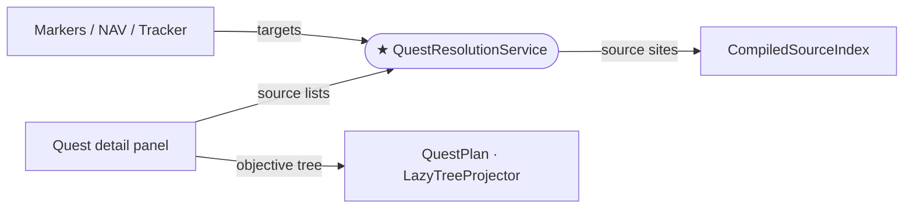

# AdventureGuide — Architecture Notes

This file is read by any agent working in the AdventureGuide mod. Read it
before touching source files under `src/` or `tests/`.

---

## Layer hierarchy

The mod is organised into strict layers. Each layer may only import from layers
below it. No upward or lateral dependencies.

| Layer | Namespaces | Responsibility |
|---|---|---|
| **Graph** | `AdventureGuide.Graph` | Immutable world data: `Node`, `Edge`, `EntityGraph`, `CompiledSourceIndex`, blueprints |
| **State** | `AdventureGuide.State` | Runtime game conditions: quest journal, inventory, live scene objects, per-type node state |
| **Plan** | `AdventureGuide.Plan`, `.Plan.Semantics` | Derived dependency structure: plan tree, feasibility propagation, frontier, faction rules |
| **Position** | `AdventureGuide.Position` | World coordinate resolution per node type; cross-zone routing |
| **Resolution** | `AdventureGuide.Resolution` | Answers "what should the player do now?": plan caching, target resolution, position lookup |
| **Navigation** | `AdventureGuide.Navigation` | Arrow renderer, ground path, proximity-based target selection |
| **Markers** | `AdventureGuide.Markers` | World-space billboard markers from resolution outputs |
| **UI** | `AdventureGuide.UI`, `.UI.Tree` | Dear ImGui windows: guide panel, tracker, detail tree via `LazyTreeProjector` |
| **Rendering** | `AdventureGuide.Rendering` | ImGui/Unity backend; no AG dependencies |
| **Config** | `AdventureGuide.Config` | BepInEx config entries |
| **Frontier** | `AdventureGuide.Frontier` | Selected navigation target set; no AG dependencies |

`Diagnostics/` and `Patches/` are cross-cutting: they depend on many layers
above but have no callers. `Plugin.cs` is the composition root.

---

## Source-visibility policy

### The rule

When at least one hostile `DropsItem` source exists for an item, friendly
`DropsItem` sources are suppressed. Non-drop sources (SellsItem, GivesItem,
etc.) are always shown.

### Where it lives

`Plan/SourceVisibilityPolicy.cs` — in the **Plan** layer alongside
`FactionChecker`, which it delegates to. Both `Resolution` and `UI.Tree`
already depend on `Plan`, so neither creates a new cross-layer edge by
importing this class.

### Two rendering paths

| Surface | Code path | Filter mechanism |
|---|---|---|
| Markers, NAV arrow, tracker | `QuestResolutionService.ApplyHostileDropFilter` | delegates to `SourceVisibilityPolicy.FilterBlueprints` |
| Quest detail panel | `LazyTreeProjector.CollectVisibleRefs` flatten branch for `PlanGroupKind.ItemSources` groups | two-pass loop using `SourceVisibilityPolicy.IsHostileDropSource` |

`ViewRenderer` constructs its own `SourceVisibilityPolicy` and passes it to
`LazyTreeProjector`. `QuestResolutionService` constructs its own.
The policy is stateless; shared instances are not required.

### Adding a new visibility rule

1. Add the rule to `SourceVisibilityPolicy` (new method or extend existing).
2. Apply in `QuestResolutionService.ApplyHostileDropFilter` (blueprint path).
3. Apply in `LazyTreeProjector.CollectVisibleRefs` (plan-tree path) using the
   predicate or new method.
4. Add tests to `Plan/SourceVisibilityPolicyTests.cs`.
5. Update this AGENTS.md if the topology changes.

### Do not add filter logic elsewhere

`QuestPlanBuilder` builds unfiltered structure. `CompiledSourceIndex` is
pure precompiled data. Source-visibility policy belongs exclusively in
`SourceVisibilityPolicy`.

---

## `PlanGroupKind.ItemSources`

Source groups for items use `PlanGroupKind.ItemSources` (not `AnyOf`). This
lets `LazyTreeProjector.CollectVisibleRefs` identify them by kind for the
visibility filter without key-string matching. Semantics for feasibility
propagation are identical to `AnyOf`: infeasible when all children are
infeasible.

The group key is still `{itemKey}:sources:anyof` (internal deduplication
string, not the kind enum). Do not rely on the key string to detect source
groups — use `GroupKind == PlanGroupKind.ItemSources`.

---

## Character / spawn-point / corpse system

Read this section before touching `CharacterPositionResolver`,
`LiveStateTracker`, `NavigationTargetSelector`, `NavigationEngine`,
`MarkerComputer`, `MarkerSystem`, `QuestResolutionService`, or any patch
that intercepts NPC spawn, death, corpse, or loot events.

### 1. Identity layers

| Layer | Canonical key | Meaning |
|---|---|---|
| Conceptual source | `Character` node key, e.g. `character:islander bandit` | Loot edges, quest semantics, display name |
| Physical source | `SpawnPoint` node key, e.g. `spawn:stowaway:342.23:52.52:490.37` | One concrete world placement in one scene |
| Concrete target instance | `ResolvedQuestTarget.SourceKey ?? ResolvedQuestTarget.TargetNodeKey` | The world object NAV and markers must cut over between |

A character can have many physical sources. Multiple character nodes may also
share the same physical source. That is common in the export data for repeated
NPC variants with identical loot tables and display names.

`TargetNodeKey` is therefore **not** a world-instance identity. Use the
physical source key whenever one exists. Character markers, NAV cutover, and
same-target change detection all operate on the concrete target instance, not
the conceptual character key.

### 2. Runtime source states

Every character source resolves to one of these occupancy states:

| Occupancy state | Meaning | Position anchor |
|---|---|---|
| `Alive` | Live NPC game object exists and `Character.Alive` is true | live NPC transform |
| `CorpsePresent` | NPC game object still exists but `Alive` is false | corpse transform at kill position |
| `SpawnEmpty` | No game object currently occupies the source | static spawn coordinates |
| `NightLocked` | Night-only spawn is currently unavailable | static spawn coordinates |
| `UnlockBlocked` | Source is gated by quest/world state | static spawn coordinates |
| `Disabled` | Source cannot spawn for gameplay reasons | static spawn coordinates |
| `Unknown` | Source is out of scene or live state is unavailable | static/exported coordinates only |

Actionability is derived from occupancy plus quest semantics:

| Case | `IsActionable` | Rule |
|---|---|---|
| Alive kill / talk target | true | the player can act on the live NPC now |
| Corpse for `DropsItem` | `CorpseContainsItem(source, itemKey)` | only actionable while the required item is still on the corpse |
| Corpse for non-loot semantics | semantic-specific | do not assume all corpses are lootable |
| SpawnEmpty / NightLocked / UnlockBlocked / Disabled / Unknown | false | marker may remain, but as timer/blocked information only |
| Zone-reentry `LootChest` | true while chest exists and still contains the item | separate target type, not an NPC |

### 3. Marker presentation states

`MarkerEntry.Type` is a presentation state, not a source state. Relevant kinds
for character flows are:

- Quest semantics: `QuestGiver`, `QuestGiverRepeat`, `QuestGiverBlocked`,
  `Objective`, `TurnInPending`, `TurnInReady`, `TurnInRepeatReady`
- Runtime overlays: `DeadSpawn`, `NightSpawn`, `QuestLocked`, `ZoneReentry`

A single physical source can legitimately project more than one marker entry:

- the live quest marker anchored to the current NPC/corpse
- the separate static respawn-timer marker (`|respawn`) at the source location

For kill semantics, the active quest marker exists only while the source is
currently actionable. Once a kill source is dead and non-actionable, the active
marker disappears and the static respawn-timer marker becomes the only marker
for that source.
Those entries are different by design. Duplicate quest markers for the same
physical source are not.

### 4. Lifecycle

1. **Spawn** — `SpawnPoint.SpawnNPC` instantiates the NPC, assigns
   `sp.SpawnedNPC`, adds it to `NPCTable.LiveNPCs`, and `SpawnPatch` calls
   `LiveStateTracker.OnNPCSpawn(sp)`. The emitted fact is keyed by the
   physical source (`spawn:*`).
2. **Alive** — resolution and markers use the live NPC transform. This is the
   only state where per-frame tracking follows a wandering NPC.
3. **Death** — `DeathPatch` calls `LiveStateTracker.OnNPCDeath(npc)`. The dead
   NPC remains as a corpse game object; `sp.SpawnedNPC` still points at it.
4. **Corpse present** — the corpse is a first-class entity at the kill
   position. Loot checks read `LootTable.ActualDrops` from the corpse game
   object itself. Do not infer corpse loot from static drop tables.
5. **Corpse looted / corpse rot** — once the corpse is emptied or its rot timer
   expires, Unity destroys the corpse game object. The source then becomes
   `SpawnEmpty`. NAV and markers must fall back to the static source position.
6. **Respawn** — `SpawnPoint.Update` creates a new NPC and replaces
   `sp.SpawnedNPC`. The source returns to `Alive`.
7. **Zone exit with unlooted corpse** — corpse data is persisted by the game in
   `CorpseDataManager`; this is not a scene object.
8. **Zone reentry chest** — `CorpseData.SpawnMe` instantiates a `RotChest` with
   a `LootTable`. This is modeled as `ResolvedActionKind.LootChest` /
   `NavigationTargetKind.LootChest`, not as a live NPC or corpse.

### 5. Selection and tracking rules

The selector and renderer answer different questions:

- `NavigationTargetSelector` chooses the best **physical source** each tick
  based on current scene, route availability, guaranteed loot, actionability,
  and proximity.
- `NavigationEngine.Track()` follows the currently selected source's live
  occupant. It must not rescan all equivalent NPCs globally, or NAV can drift
  away from the selected source.
- `MarkerComputer` keys character markers by the physical source node, not by
  the conceptual character key or by the NPC's current live position.
- `MarkerSystem` may update the rendered position every frame, but it does not
  own source identity. Identity comes from the resolved source key.

### 6. Directly-placed characters

Directly-placed NPCs have `MySpawnPoint = null` and no real `SpawnPoint`
component. The export pipeline creates a synthetic spawn node with
`IsDirectlyPlaced = true`. Treat that synthetic spawn node exactly like any
other physical source key for NAV and marker identity.

Live-state lookup for directly-placed NPCs goes through
`ResolveDirectlyPlacedSpawn` / `FindNpcByNameAndProximity`. Respawn happens via
zone reentry, not `SpawnPoint.Update`. When dead with no corpse present, the
source presents as `ZoneReentry`.

### 7. Non-negotiable invariants

1. Death/spawn/corpse facts are keyed by the physical source node
   (`spawn:*`), because cache invalidation and marker/NAV cutover depend on
   concrete source identity.
2. `SourcePositionCache` must never cache `NodeType.Character` positions.
   Character positions are live-state dependent.
3. `CorpseContainsItem` must run inside a dependency collection scope so the
   source-state fact is recorded correctly.
4. Synthetic chest keys use the `chest:` prefix and must never collide with real
   graph node keys.
5. `OnAllCorpsesSpawned` and `OnSceneLoaded` must clear `_rotChests` before
   rescanning to avoid stale chest references.
6. If two resolved character targets share the same physical source key, world
   markers and NAV treat them as the same concrete target instance. The source
   key wins over the conceptual character key.
7. Non-actionable kill targets do not emit an active character marker. The
   respawn-timer marker owns dead/empty representation for those sources.